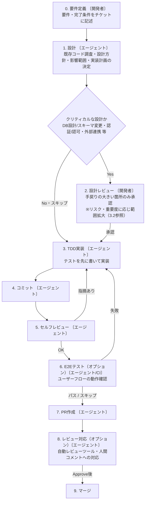

# AI駆動開発戦略

## 1. 概要

本ドキュメントは、AI駆動開発における**開発フローと品質保証**を定義する。

核となる考え方:

- **開発者は要件定義とレビュー・承認に集中し、設計・実装はAIエージェントが担う**
- **1エージェントが1チケットを設計〜実装〜PR作成まで自律的に完結させる**
- **手戻りの大きいクリティカルな設計（DB設計等）に限り、実装前に人がレビューする**
- **変更のリスク・重要度に応じてユーザーがレビュー範囲を判断し、人的レビュー負荷と品質のバランスを取る**

> 本ドキュメントは開発フローに必要な汎用的な枠組みを定義する。チーム体制・役割分担・オーナーシップといった組織固有の運用は、各プロジェクト側で定義する。

### 関連ドキュメント

- [ブランチ戦略](./branching-strategy.md) — GitHub Flow、PR規約

---

## 2. エージェントの1チケット実行フロー

AI駆動開発では、**1エージェントが1チケットを最初から最後まで完結させる**構成をとる。開発者は要件を定義してエージェントに渡し、設計・実装はエージェントに委ねて、生成物のレビュー・承認に集中する。

```
開発者
├── エージェント 1 ──→ チケット A（実装→テスト→セルフレビュー→PR作成）
├── エージェント 2 ──→ チケット B（実装→テスト→セルフレビュー→PR作成）
├── エージェント 3 ──→ チケット C（実装→テスト→セルフレビュー→PR作成）
└── エージェント 4 ──→ チケット D（実装→テスト→セルフレビュー→PR作成）
```

Claude Code を使用する場合の階層:

| 階層 | 役割 | 例 |
|------|------|-----|
| メインセッション | 1チケットの開発サイクル全体を管理 | `/para-impl 123` で自律実行 |
| サブエージェント | メインセッション内で特定タスクを実行 | コードベース探索、テスト実行 |
| Skills | 定型タスクの自動実行 | `/commit`, `/self-review`, `/quality-check` |

要件は開発者が定義し、**設計以降はエージェントが自律的に実行する**。ただしDB設計など手戻りの大きいクリティカルな設計に限り、実装前に開発者がレビューする。



> **ブランチ運用の前提**: このフローは「**1チケット = 1ブランチ → PR → 必須ゲート通過後に mainline へマージ**」を前提とする（タスクを分離し、PR経由で統合する）。この最小契約さえ満たせば、ブランチ命名・マージ方式・リリース方式などの具体は各プロジェクトで自由に定めてよい。既定例は [ブランチ戦略](./branching-strategy.md) を参照。

---

## 3. 品質保証とレビュー負荷の設計

### 3.1 基本方針

AI駆動開発では「AIが実装し、人間がレビュー・承認する」形をとる。ここで課題となるのが**人的レビュー負荷**である。

現在のAIエージェントは設計・コードとも品質が十分に高く、詳細設計や実装そのものに問題があるケースは少ない。そこで本戦略では、**人間のレビューを次の2点に絞る**:

- **要件定義（チケット）**: 「何を作るか」は人間が決める。AI駆動開発の起点であり、最も手戻りの大きい判断。
- **クリティカルな設計**: DB設計・スキーマ変更、認証/認可、外部連携など、誤ると手戻りが大きい設計のみ実装前にレビューする（→ 3.4）。

**詳細設計・実装・コードはエージェントを信頼**し、品質は**テスト（特にE2Eテスト）とセルフレビューを主軸**に担保する。どこまで人的レビューを広げるかは固定の段階で定めず、**変更のリスク・重要度に応じてユーザーがケースバイケースで判断する**。

なお、**自動・セルフで常に通す必須ゲート**は、レビュー範囲の判断に関わらず適用する:

| 必須ゲート | 内容 | 担い手 |
|----------|------|--------|
| Lint・型チェック・テスト | PR作成前にパスする | エージェント（`/quality-check` 等で自動） |
| セルフレビュー | テスト設計・実装とコードを自己検証、完了条件の達成を確認 | エージェント |
| CI | 全テストがパスする | 自動 |
| マージ | 必要なゲートを通過後にマージ | 開発者 |

### 3.2 レビューの優先順位

人的レビューは**優先度の高い観点から行い、変更のリスク・重要度に応じて、どこまで下位の観点をレビューするかをユーザーが判断する**。観点の優先順位は次のとおり。

| 優先度 | レビュー観点 | 内容 |
|------|------------|------|
| 1（Must） | 動作確認・E2E | ユーザーフローが期待どおり動くか。最低限の動作確認は必須、必要に応じて自動E2Eに拡大 |
| 2 | 要件（AIへの入力）・クリティカルな設計 | 「何を作るか」と、DB/スキーマ・認証/認可・外部連携 等の手戻りの大きい設計（→ 3.4） |
| 3 | それ以外の設計（詳細設計） | クリティカル以外の設計判断 |
| 4 | コード | 実装コード・テストの精読 |

- **優先度1〜2は常に必須**。動作確認・E2Eで品質を担保し、要件とクリティカルな設計の正しさを人間が確認する。
- **リスク・重要度が高い変更では優先度3→4へ対象を広げる**。詳細設計のレビューを加え、特に重要なものはコードレビューも足す。
- 詳細設計・コード（優先度3〜4）は本来エージェントを信頼する領域であり、人的レビューを足すかはユーザーが変更ごとに判断する。

> **原則**: AIは詳細設計・コードとも品質が十分高い。人間がまず時間をかけるべきは「動作するか（動作確認・E2E）」「何を作るか（要件）」「手戻りの大きいクリティカルな設計」であり、詳細設計やコードの精読は後回しでよい。

#### どこまで広げるかの判断基準

下位の観点（詳細設計→コード）までレビューを広げ、E2E自動化・手動QA・第三者レビューを足すかは、次の要因が高い変更ほど手厚くする。

| 判断要因 | レビュー・テストを手厚くする方向 |
|---------|------------------------------|
| ユーザー影響範囲 | 広いほど手厚く |
| データの機密性 | 高いほど手厚く（該当時はクリティカル箇所として必ずレビュー → 3.4） |
| 規制・コンプライアンス | 厳格なほど手厚く（第三者レビュー・テストエビデンス） |
| 障害時の影響 | 大きいほど手厚く |
| 仕様の安定度・コード寿命 | 安定・長寿命なほどテスト整備・レビューの投資価値が高い（短命なら軽く） |

### 3.3 テスト戦略

コードレビューを最小限に抑える代わりに、**テストを品質担保の主軸**とする。各テストの責務は以下のとおり。

| テスト種別 | 実行者 | 目的 |
|-----------|--------|------|
| 単体テスト / 結合テスト | AIエージェント | 実装の正しさを検証 |
| テスト設計・実装のセルフレビュー | AIエージェント | テスト観点の網羅性・テスト実装の妥当性を自己検証 |
| E2Eテスト（自動） | CI / AIエージェント | ユーザーフローの動作保証 |
| 動作確認（ライブ） | AIエージェント（人間は観察） / 開発者 | 画面を操作して期待どおり動くかを確認 |
| E2Eテスト（手動） | 開発者（必要に応じて手動QA） | 自動化困難な操作・UXの確認 |

> **動作確認のAI化**: 優先度1の「動作確認」は、AIが可視ブラウザ（Headed Playwright）でアプリを操作・実況し、**人間は画面を観察して承認するだけ**の形を取れる。成功したシナリオはそのままE2Eテストとして永続化できる（動作確認とE2E整備の一気通貫）。

E2Eテストの範囲は、変更のリスク・重要度に応じてユーザーが判断して広げる（→ 3.2 の判断基準）。

#### E2Eレビューの工夫

E2Eはコードレビューを最小化する本戦略の品質の主軸であり、重要度が上がるほど価値も工数も大きくなる。一方でE2E実装コードを人間が精読するのは負荷が高い。そこで**E2Eは実装コードではなく、AIによる解説と設計（観点）をレビューする**。人間は常にコードを読まず、次の3層で確認する。

| 層 | タイミング | レビュー対象 | 目的 |
|----|-----------|------------|------|
| 設計レビュー | 実装前 | E2Eシナリオ（観点）一覧／完了条件とのトレーサビリティ | 正しいフローを過不足なくカバーしているか |
| 解説レビュー | 実装後 | AIによる各E2Eの解説（対象フロー・前提・操作手順・検証内容・カバー/非カバー範囲） | 正しい観点で検証しているか |
| 裏取り | 実装後 | 解説とコードの整合・テストの有効性 | 解説どおりにテストが機能しているか |

- **設計レビュー**: 実装前に、AIが要件・完了条件からE2Eシナリオ一覧を提案する。人間は完了条件とのマッピングを見て、カバレッジの過不足を確認する（要件レビューと一体で実施）。
- **解説レビュー**: 実装後に、AIが各E2Eを自然言語で解説する。人間は解説を要件と突き合わせて確認し、解説内容を信頼してコードは読まない。
- **裏取り**: 解説レビューは「解説とコードの乖離」（アサーションが無い・実行されない等）を単体では見抜けない。次のいずれかで担保する。
  - **独立した検証エージェント**が実装を読み、解説の忠実性とアサーションの妥当性をチェックする（人間はコードを読まない）
  - **実行エビデンス**（Playwright の trace／動画／スクリーンショット）でフローが実際に通っていることを確認する
  - 重要フローは**ミューテーション（故意の不具合注入）**でテストが確かに失敗することを確認する

> **原則**: コードレビューで見つけるべきバグは、テストで検出する。設計レビューで方向性を正し、テストで品質を担保する——これがAI駆動開発における品質保証の基本構造である。

### 3.4 クリティカル箇所

以下に該当する場合、**レビュー範囲の判断に関わらず**、最低限のレビューを必須とする（使い捨て前提の検証コードを除く）:

- セキュリティに関わる箇所（認証・認可、入力検証）
- 機密データ・個人情報の取り扱い
- 外部システム連携
- データベーススキーマの変更

レビューの担い手は次のとおり。

| レビュー | 担い手 | 要否 |
|---------|--------|------|
| 設計レビュー | 人間 | **必須**。脅威モデル・影響範囲・不可逆性など、人間の判断が要る領域 |
| コードレビュー | AIエージェント（専用レビューエージェント） | **必須** |
| コードレビュー | 人間 | 必須としない。重要度が極めて高い場合や、AIが懸念を上げた場合にエスカレーション |

> **理由**: クリティカル箇所でも、コードの精査はAIの方が安定して網羅的なことが多い。希少な人的リソースは設計判断に集中させ、コードはAIレビュー＋テストで多層に担保する。

> **注意**: 使い捨て前提のコードであっても、クリティカル箇所を含む変更を本番コードに流用する場合は、必ず再レビューを行うこと。

---

## 4. ナレッジ管理

### 4.1 AIエージェントへのコンテキスト共有

AIエージェントが正確に実装するには、十分なコンテキストの提供が不可欠である。ただし**必要なドキュメントはプロジェクトによって変わる**ため、絶対に必須のものだけを定め、それ以外は**プロジェクトごとに「何を作るか」を決める**運用とする。

#### 必須ドキュメント

| ドキュメント | 目的 | 更新頻度 |
|------------|------|---------|
| CLAUDE.md | プロジェクトコンテキスト（規約・構成・コマンド）の起点。全エージェントが参照する | 随時 |

> CLAUDE.md は `/init-project` で生成・整備できる。

#### プロジェクトごとに選定するドキュメント

CLAUDE.md 以外は、プロジェクトの特性（規模・ドメイン・技術スタック・チーム）に応じて必要なものだけを整備する。候補例:

- コーディングガイドライン（コード規約の統一）
- アーキテクチャ設計書（全体構成の理解）
- API仕様書（エンドポイント定義）
- テーブル定義書（DB構造の理解）
- 用語集（ドメイン知識の共有）
- その他、プロジェクト固有のドキュメント

どのドキュメントを整備するかは、立ち上げ時に**ドキュメント選定スキル**で判断する（プロジェクトの特性から、必要なドキュメントセットと作成優先度を提案）。整備したドキュメントは CLAUDE.md から参照を張り、エージェントが辿れるようにする。

### 4.2 チケットの質がエージェントの質を決める

AIエージェントのアウトプット品質は、**チケットの記述品質**に直結する。

良いチケットの条件:
- 1エージェントが独立して完結できる粒度
- 明確な完了条件（受入基準）
- 参照すべきドキュメント・コードの明示
- 技術的な制約の記載
- 他チケットとの依存関係の明示

チケット作成は `/create-ticket` スキルが支援する（チケット構造・粒度のガイドを含む）。

---

## 5. リスクと対策

| リスク | 対策 |
|--------|------|
| AIの出力品質のばらつき | 品質ゲート（自動チェック + 人間レビュー）で担保 |
| AIへの過度な依存 | クリティカル箇所は判断に関わらず必ず人間がレビュー |
| レビュー負荷の集中 | レビュー観点の優先順位に沿い、変更のリスク・重要度に応じて範囲を判断 |
| コンテキスト不足による実装ミス | CLAUDE.md・設計書・チケット記述の整備で対処 |
| レビュー省略による品質低下 | 省略は使い捨て前提のコードに限定。本番流用時は再レビュー必須 |
