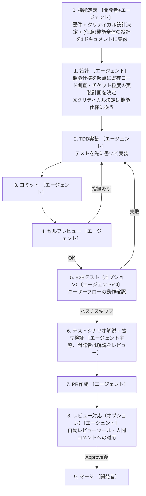

# AI駆動開発戦略

## 1. 概要

本ドキュメントは、AI駆動開発における**開発フローと品質保証**を定義する。

核となる考え方:

- **開発者は要件定義とレビュー・承認に集中し、設計・実装はAIエージェントが担う**
- **1エージェントが1チケットを設計〜実装〜PR作成まで自律的に完結させる**
- **手戻りの大きいクリティカルな設計（DB設計等）に限り、実装前に人がレビューする**
- **変更のリスク・重要度に応じてユーザーがレビュー範囲を判断し、人的レビュー負荷と品質のバランスを取る**
- **正しさの権威はコードとテストにあり、機能仕様は保守するが正しさを担保しない**（既定フローの正本は → 4.4）

> 本ドキュメントは開発フローに必要な汎用的な枠組みを定義する。チーム体制・役割分担・オーナーシップといった組織固有の運用は、各プロジェクト側で定義する。

### 関連ドキュメント

- [ブランチ戦略](./branching-strategy.md) — GitHub Flow、PR規約
- [ADR 0002: GDD（保証駆動開発）を不採用とし、計装のみ回収する](./adr/0002-gdd-not-adopted-salvage-instruments.md) — 既定フロー（4.4）を確定させた決定と根拠
- [欠陥クラスのカタログ](./defect-class-catalog.md) — 独立の敵対レビュー（`/self-review sweep`）が掃引に使う欠陥クラスの正本。本文書 4.5 と同じ「正本1箇所＋逐語コピー＋cross-file 照合テスト」の規律に乗る

---

## 2. エージェントの1チケット実行フロー

AI駆動開発では、**1エージェントが1チケットを最初から最後まで完結させる**構成をとる。開発者は要件を定義してエージェントに渡し、設計・実装はエージェントに委ねて、生成物のレビュー・承認に集中する。

```
開発者
├── エージェント 1 ──→ チケット A（実装→テスト→セルフレビュー→PR作成）
├── エージェント 2 ──→ チケット B（実装→テスト→セルフレビュー→PR作成）
├── エージェント 3 ──→ チケット C（実装→テスト→セルフレビュー→PR作成）
└── エージェント 4 ──→ チケット D（実装→テスト→セルフレビュー→PR作成）
```

Claude Code を使用する場合の階層:

| 階層 | 役割 | 例 |
|------|------|-----|
| メインセッション | 1チケットの開発サイクル全体を管理 | `/para-impl 123` で自律実行 |
| サブエージェント | メインセッション内で特定タスクを実行 | コードベース探索、テスト実行 |
| Skills | 定型タスクの自動実行 | `/commit`, `/self-review`, `/quality-check` |

要件は開発者が定義し、**設計以降はエージェントが自律的に実行する**。**クリティカルな設計の意思決定（DB スキーマ・認証/認可・外部連携 等）は機能定義の段階でまとめて行い**、機能仕様ドキュメント（`docs/features/{slug}.md`）に記録する。実装フェーズに人間ゲートを残さないことで、複数チケットの並列実装を中断なく走らせる。


```mermaid
flowchart TD
    A["0. 機能定義 〔開発者+エージェント〕<br/>要件 + クリティカル設計決定 + (任意)機能全体の設計を1ドキュメントに集約"]
    B["1. 設計 〔エージェント〕<br/>機能仕様を起点に既存コード調査・チケット粒度の実装計画を決定<br/>※クリティカル決定は機能仕様に従う"]
    E["2. TDD実装 〔エージェント〕<br/>テストを先に書いて実装"]
    F["3. コミット 〔エージェント〕"]
    G["4. セルフレビュー 〔エージェント〕"]
    K["5. E2Eテスト（オプション）〔エージェント/CI〕<br/>ユーザーフローの動作確認"]
    EX["6. テストシナリオ解説 + 独立検証 〔エージェント主導、開発者は解説をレビュー〕"]
    H["7. PR作成 〔エージェント〕"]
    I["8. レビュー対応（オプション）〔エージェント〕<br/>自動レビューツール・人間コメントへの対応"]
    J["9. マージ 〔開発者〕"]

    A --> B
    B --> E
    E --> F
    F --> G
    G -->|指摘あり| E
    G -->|OK| K
    K -->|失敗| E
    K -->|パス / スキップ| EX
    EX --> H
    H --> I
    I -->|Approve後| J
```

> **ブランチ運用の前提**: このフローは「**1チケット = 1ブランチ → PR → 必須ゲート通過後に mainline へマージ**」を前提とする（タスクを分離し、PR経由で統合する）。この最小契約さえ満たせば、ブランチ命名・マージ方式・リリース方式などの具体は各プロジェクトで自由に定めてよい。既定例は [ブランチ戦略](./branching-strategy.md) を参照。

> **どの文書が正か（既定フロー）**: 本章はチケット1本が回る**手順**を定義する。手順の中でどの文書が正しさの権威を持つか——既定は **SDD ＋ コード正（テスト正）** であり、機能仕様は保守するが正しさは担保しない——は **4.4** が正本である。

---

## 3. 品質保証とレビュー負荷の設計

### 3.1 基本方針

AI駆動開発では「AIが実装し、人間がレビュー・承認する」形をとる。ここで課題となるのが**人的レビュー負荷**である。

現在のAIエージェントは設計・コードとも品質が十分に高く、詳細設計や実装そのものに問題があるケースは少ない。そこで本戦略では、**人間のレビューを次の2点に絞る**:

- **機能定義（要件 + クリティカル設計決定）**: 「何を作るか」と「DB設計・スキーマ変更、認証/認可、外部連携など、誤ると手戻りが大きい設計の方針」を人間が決める。これらを**機能定義の段階でまとめて決定**することで、実装フェーズに人間ゲートを残さず、複数チケットの並列実装を中断なく回せる（→ 3.4）。
- **テストシナリオ解説（実装後）**: 実装が一通り終わった段階で、AIが各E2Eを自然言語で解説する。人間はその解説を完了条件と突き合わせて確認する（→ 3.3）。

**詳細設計・実装・コードはエージェントを信頼**し、品質は**テスト（特にE2Eテスト）とセルフレビューを主軸**に担保する。どこまで人的レビューを広げるかは固定の段階で定めず、**変更のリスク・重要度に応じてユーザーがケースバイケースで判断する**。

なお、**自動・セルフで常に通す必須ゲート**は、レビュー範囲の判断に関わらず適用する:

| 必須ゲート | 内容 | 担い手 |
|----------|------|--------|
| Lint・型チェック・テスト | PR作成前にパスする | エージェント（`/quality-check` 等で自動） |
| セルフレビュー | テスト設計・実装とコードを自己検証、完了条件の達成を確認 | エージェント |
| CI | 全テストがパスする | 自動 |
| マージ | 必要なゲートを通過後にマージ | 開発者 |

### 3.2 レビューの優先順位

人的レビューは**優先度の高い観点から行い、変更のリスク・重要度に応じて、どこまで下位の観点をレビューするかをユーザーが判断する**。観点の優先順位は次のとおり。

| 優先度 | レビュー観点 | 内容 |
|------|------------|------|
| 1（Must） | 動作確認・E2E | ユーザーフローが期待どおり動くか。最低限の動作確認は必須、必要に応じて自動E2Eに拡大 |
| 2 | 要件（AIへの入力）・クリティカルな設計 | 「何を作るか」と、DB/スキーマ・認証/認可・外部連携 等の手戻りの大きい設計（→ 3.4） |
| 3 | それ以外の設計（詳細設計） | クリティカル以外の設計判断 |
| 4 | コード | 実装コード・テストの精読 |

- **優先度1〜2は常に必須**。動作確認・E2Eで品質を担保し、要件とクリティカルな設計の正しさを人間が確認する。
- **リスク・重要度が高い変更では優先度3→4へ対象を広げる**。詳細設計のレビューを加え、特に重要なものはコードレビューも足す。
- 詳細設計・コード（優先度3〜4）は本来エージェントを信頼する領域であり、人的レビューを足すかはユーザーが変更ごとに判断する。

> **原則**: AIは詳細設計・コードとも品質が十分高い。人間がまず時間をかけるべきは「動作するか（動作確認・E2E）」「何を作るか（要件）」「手戻りの大きいクリティカルな設計」であり、詳細設計やコードの精読は後回しでよい。

#### どこまで広げるかの判断基準

下位の観点（詳細設計→コード）までレビューを広げ、E2E自動化・手動QA・第三者レビューを足すかは、次の要因が高い変更ほど手厚くする。

| 判断要因 | レビュー・テストを手厚くする方向 |
|---------|------------------------------|
| ユーザー影響範囲 | 広いほど手厚く |
| データの機密性 | 高いほど手厚く（該当時はクリティカル箇所として必ずレビュー → 3.4） |
| 規制・コンプライアンス | 厳格なほど手厚く（第三者レビュー・テストエビデンス） |
| 障害時の影響 | 大きいほど手厚く |
| 仕様の安定度・コード寿命 | 安定・長寿命なほどテスト整備・レビューの投資価値が高い（短命なら軽く） |

### 3.3 テスト戦略

コードレビューを最小限に抑える代わりに、**テストを品質担保の主軸**とする。各テストの責務は以下のとおり。

| テスト種別 | 実行者 | 目的 |
|-----------|--------|------|
| 単体テスト / 結合テスト | AIエージェント | 実装の正しさを検証 |
| テスト設計・実装のセルフレビュー | AIエージェント | テスト観点の網羅性・テスト実装の妥当性を自己検証 |
| E2Eテスト（自動） | CI / AIエージェント | ユーザーフローの動作保証 |
| 動作確認（ライブ） | AIエージェント（人間は観察） / 開発者 | 画面を操作して期待どおり動くかを確認 |
| E2Eテスト（手動） | 開発者（必要に応じて手動QA） | 自動化困難な操作・UXの確認 |

> **動作確認のAI化**: 優先度1の「動作確認」は、AIが可視ブラウザ（Headed Playwright）でアプリを操作・実況し、**人間は画面を観察して承認するだけ**の形を取れる。成功したシナリオはそのままE2Eテストとして永続化できる（動作確認とE2E整備の一気通貫）。

E2Eテストの範囲は、変更のリスク・重要度に応じてユーザーが判断して広げる（→ 3.2 の判断基準）。

#### E2Eレビューの工夫

E2Eはコードレビューを最小化する本戦略の品質の主軸であり、重要度が上がるほど価値も工数も大きくなる。一方でE2E実装コードを人間が精読するのは負荷が高い。そこで**E2Eは実装コードではなく、AIによる解説と設計（観点）をレビューする**。人間は常にコードを読まず、次の3層で確認する。

| 層 | タイミング | レビュー対象 | 担い手 | 目的 |
|----|-----------|------------|--------|------|
| 設計セルフレビュー | 実装前 | E2Eシナリオ（観点）一覧／完了条件とのトレーサビリティ | **AIエージェント** | 正しいフローを過不足なくカバーしているか |
| テストシナリオ解説 | 実装後 | AIによる各E2Eの解説（対象フロー・前提・操作手順・検証内容・カバー/非カバー範囲） | **人間**（AI が解説を生成） | 正しい観点で検証しているか |
| 独立検証 | 実装後 | 解説とコードの整合・テストの有効性 | AI主導／人間は結果を確認 | 解説どおりにテストが機能しているか |

- **設計セルフレビュー**: 実装前に、AIが要件・完了条件からE2Eシナリオ一覧を提案し、**AI自身が完了条件とのトレーサビリティ表で過不足をセルフチェックする**。人間ゲートは入れない（並列実装の中断を避ける）。
- **テストシナリオ解説**: 実装後に、AIが各E2Eを自然言語で解説する。**人間はここで初めて参加**し、解説を要件（完了条件・受入基準）と突き合わせて確認する。解説内容を信頼してコードは読まない。
- **独立検証**: テストシナリオ解説の確認だけでは「解説とコードの乖離」（アサーションが無い・実行されない等）を見抜けない。次のいずれかで担保する。
  - AIが実装コードを読み、解説の忠実性とアサーションの妥当性をチェックする（人間はコードを読まない）
  - **実行エビデンス**（Playwright の trace／動画／スクリーンショット）でフローが実際に通っていることを確認する
  - 重要フローは**ミューテーション（故意の不具合注入）**でテストが確かに失敗することを確認する

> **原則**: コードレビューで見つけるべきバグは、テストで検出する。設計レビューで方向性を正し、テストで品質を担保する——これがAI駆動開発における品質保証の基本構造である。

### 3.4 クリティカル箇所

以下に該当する場合、**レビュー範囲の判断に関わらず**、最低限のレビューを必須とする（使い捨て前提の検証コードを除く）:

- セキュリティに関わる箇所（認証・認可、入力検証）
- 機密データ・個人情報の取り扱い
- 外部システム連携
- データベーススキーマの変更

#### 意思決定のタイミング

クリティカル設計の意思決定は**機能定義の段階でまとめて行う**（`/define-feature` の責務）。実装フェーズに人間ゲートを置かないことで、複数チケットの並列実装を中断なく回せる。

機能仕様ドキュメント（`docs/features/{slug}.md`）には「クリティカル設計決定」セクションを設け、認可モデル・暗号化方式・スキーマ方針・外部API契約などの方針を記録する。後続の `feature-implementer` は、その決定に従って実装する（独自判断で逸脱しない）。

#### レビューの担い手

| レビュー | 担い手 | タイミング | 要否 |
|---------|--------|------------|------|
| クリティカル設計の意思決定 | 人間 | **機能定義時** | **必須**。脅威モデル・影響範囲・不可逆性など、人間の判断が要る領域 |
| コードレビュー | AIエージェント（専用レビューエージェント） | 実装中 | **必須** |
| コードレビュー | 人間 | PRレビュー時 | 必須としない。重要度が極めて高い場合や、AIが懸念を上げた場合にエスカレーション |

> **理由**: クリティカル箇所でも、コードの精査はAIの方が安定して網羅的なことが多い。希少な人的リソースは**機能定義時の設計判断**に集中させ、コードはAIレビュー＋テストで多層に担保する。

> **注意**: 使い捨て前提のコードであっても、クリティカル箇所を含む変更を本番コードに流用する場合は、必ず再レビューを行うこと。

### 3.5 承認ゲート（本番影響ベース）

人間ゲートは「操作の見た目」ではなく **本番への影響と可逆性** で置く。可逆で本番影響のない操作は自律実行し、不可逆・本番影響のある操作にだけ人間承認を要求することで、レビュー地獄・逐次承認を避けつつ安全性を担保する。

| 操作 | 本番影響 | 可逆性 | 承認 |
|------|---------|--------|------|
| topic / 統合ブランチへの push・PR・マージ | なし | 可逆（`main` 未反映） | **不要**（自律実行可） |
| `main` へのマージ | あり（デプロイ即稼働） | 実質不可逆 | **必須**（人間） |
| 本番公開・リリース・タグ付与 | あり | 実質不可逆 | **必須**（人間） |
| ブランチ/データ削除・履歴破壊（force-push 等） | 状況次第 | 不可逆 | **必須**（人間） |

> **原則**: `main` マージ・本番公開・削除・履歴破壊のみ人間承認。**統合ブランチや topic ブランチへの push・PR・マージは自律実行可**。これは「クリティカル設計の意思決定は機能定義時にまとめて行い、実装フェーズに人間ゲートを残さない」（→ 3.4）という方針を、**大きめ機能の実装フロー**に拡張したものである。

#### 統合ブランチ方式

大きめの機能を自走で実装しつつ `main` を常に本番安全（デプロイ即稼働可）に保つため、**親 Issue 単位の統合ブランチ（integration branch）** を用いる:

- 親 Issue に対し `main` から統合ブランチ `feat/issue-<親>` を切る。
- 実装サブタスクは **統合ブランチを base に PR → レビュー対応 → 統合ブランチへ自律マージ**（`main` を触らないので本番影響なし＝人間ゲート不要）。
- 全サブタスク完了後、統合ブランチで **人間が最終動作確認 1 回** → **統合 → `main` 昇格（人間承認）**。
- ⇒ 人間の関与は「最後の動作確認＋`main` マージ承認」という**不可逆点**だけに集約できる。

具体的な base 指定・自律マージ・昇格の運用手順は [ブランチ戦略](./branching-strategy.md) の「統合ブランチ運用」を参照。`/create-ticket`・`/para-impl` の `--base` 指定、`/pr-merge` の base 別ゲート判定がこれを支援する。

---

## 4. ナレッジ管理

### 4.1 AIエージェントへのコンテキスト共有

AIエージェントが正確に実装するには、十分なコンテキストの提供が不可欠である。ただし**必要なドキュメントはプロジェクトによって変わる**ため、絶対に必須のものだけを定め、それ以外は**プロジェクトごとに「何を作るか」を決める**運用とする。

#### 必須ドキュメント

| ドキュメント | 目的 | 更新頻度 |
|------------|------|---------|
| CLAUDE.md | プロジェクトコンテキスト（規約・構成・コマンド）の起点。全エージェントが参照する | 随時 |

> CLAUDE.md は `/init-project` で生成・整備できる。

#### プロジェクトごとに選定するドキュメント

CLAUDE.md 以外は、プロジェクトの特性（規模・ドメイン・技術スタック・チーム）に応じて必要なものだけを整備する。候補例:

- コーディングガイドライン（コード規約の統一）
- アーキテクチャ設計書（全体構成の理解）
- API仕様書（エンドポイント定義）
- テーブル定義書（DB構造の理解）
- 用語集（ドメイン知識の共有）
- その他、プロジェクト固有のドキュメント

どのドキュメントを整備するかは、立ち上げ時に**ドキュメント選定スキル**で判断する（プロジェクトの特性から、必要なドキュメントセットと作成優先度を提案）。整備したドキュメントは CLAUDE.md から参照を張り、エージェントが辿れるようにする。

### 4.2 チケットの質がエージェントの質を決める

AIエージェントのアウトプット品質は、**チケットの記述品質**に直結する。

良いチケットの条件:
- 1エージェントが独立して完結できる粒度
- 明確な完了条件（受入基準）——**1基準 = 1主張 = 1検証**（粒度の規約は → 4.5）
- 参照すべきドキュメント・コードの明示
- 技術的な制約の記載
- 他チケットとの依存関係の明示

チケット作成は `/create-ticket` スキルが支援する（チケット構造・粒度のガイドを含む）。

**チケットの粒度とは別に、機能には「出荷の単位（スライス）」がある。** `/define-feature` は要件ヒアリングの最後に「それだけで出荷でき価値が出る最小の縦切り（S1）」を必ず問い、スライス表と「やらないこと」（範囲外の明示列挙）を機能仕様の必須節として残す。既定の実装対象は S1 のみで、`/create-ticket` 要件モードは実装対象スライスの要件チケットだけを起票する（1 スライス = 1 チケット）。後続スライスは前スライスの PR がマージされた後に人間または呼び出し側フローが起票し、`/pr-merge` の後処理には組み込まない——スライスの境目を、人間が「これで十分」「方向を変える」を選べる再同期点として残すためである。スライス（出荷単位）と粒度（スライス内の分割）の関係は `skills/create-ticket/references/slice-vs-granularity.md` を参照。

### 4.3 恒常的な設計決定の記録（ADR）

機能仕様（`docs/features/`）は**その機能の要件とクリティカル設計決定**を書いた文書、Issue は**その機能限りの経緯**を残す文書であり、**いま守っている振る舞いの正はコードとテスト**である（→ 4.4）。どれにも収まらないのが、**機能をまたいで今後の実装が従い続ける決定**（認可モデル・スキーマ方針・依存の方向 等）である。これを置く場所が **ADR（Architecture Decision Record）** であり、本節がその規約の正本である。

**ADR はオンデマンドである。** `/define-feature` → `/create-ticket` → `/para-impl` の定常フローに必須ステップとして組み込まない（毎機能で ADR を書かせると、読まれない記録が増えて受け皿として機能しなくなる）。**例外は機能仕様を削除するとき**で、削除が不可逆であるため昇格の要否判定（`/create-adr promote`）を挟む。既定フローでは機能仕様を保守し続けるため（→ 4.4）、削除自体が例外的な操作である。

作成・改訂は `/create-adr` が支援する（記録モードと、削除する機能仕様からの昇格判定モードの2モード）。

#### 何を ADR にするか（乱造防止の線引き）

**ADR に書くのは「宣言元の Issue を読まなくても理解できる必要がある恒常的決定」だけ**とする。個別機能の検討経緯は Issue に委ね、ADR へ持ち込まない。

次の**3条件をすべて満たすものだけ**を ADR にする（1つでも欠けたら書かない）:

1. **恒常性**: 特定の機能・チケットが終わったあとも効き続け、今後の実装が従い続ける。
2. **非自明性**: 結果のコードとテストを読んだだけでは「なぜそうなっているか」を復元できない。
3. **選択性**: 妥当な代替案が実在し、却下した理由を残さないと再燃・蒸し返しが繰り返される。

判定に使う1問: **「この決定を知らない人・エージェントが、Issue を掘らずにコードだけを見て作業したとき、決定に反する実装をしうるか」**。Yes なら ADR、No なら書かない。

| ADR に**書く** | ADR に**書かない**（委ね先） |
|---|---|
| 認証・認可モデルの選択とその適用範囲 | 個別機能の要件・受入基準（機能仕様 → Issue） |
| DB スキーマの方針（正規化方針・テナント分離方式・マイグレーション規律） | すでに守っている振る舞い（コードとテストが正 → 4.4） |
| エラー応答形式・API バージョニングなど契約の**原則**（個別エンドポイントの仕様ではない） | 実装の内部設計・アルゴリズム選択（コードとテストが正） |
| モジュール依存の方向・レイヤ境界の規律 | 一度きりの移行・作業の実施記録（PR と git 履歴が正） |
| 採用／不採用を決めた基盤技術・外部サービスとその理由 | 個別機能の検討経緯・トレードオフの議論（宣言元 Issue） |
| 組織・法令・契約に由来する制約と、その適用方針 | 恒常的だが自明な事実（コードを読めば分かる構成） |

- **迷ったら書かない**。ADR にしなかった判断自体は Issue・PR 本文に残せば追跡できる。
- **既存 ADR の改訂で足りるなら新規作成しない**。同じ問いへの答えの更新を別ファイルに分けると、どれが現行かが分からなくなる。

#### 置き場・命名・採番

- **置き場**: `docs/adr/`（`CLAUDE.md` のドキュメントマップで別パスを指定している場合はそれ）。
- **ファイル名**: `NNNN-slug.md`。`NNNN` は4桁ゼロ埋めの連番、`slug` は決定内容のケバブケース（例: `0002-auth-model.md`）。
- **採番**: 置き場の `NNNN-` 形式のファイル名の**最大値 + 1**。欠番は埋めず、**番号は再利用しない**（過去の参照「ADR 0007」の指す先を変えないため）。並列ブランチで同番号を採ってしまった場合は、**後からマージする側が採り直す**。
- **ADR 以外の記録**（実機検証記録・アーカイブ等）を同じディレクトリに置く場合は、**`NNNN-` で始まらない名前**にする（例: `archive-2026-08-01-<slug>.md`）。日付始まりの `2026-08-01-...` は 4 桁数字＋ハイフンの形が連番と区別できないため使わない。

#### 構成とステータス

本文は **背景 / 決定 / 検討した代替案 / 帰結** の4節を必須とし、冒頭にメタ情報（ステータス・日付・関連）を置く。見出しは決定の要約とし、**結論を先に読める**こと。該当しない項目は空欄で残さず削除する。

| ステータス | 意味 |
|---|---|
| `Accepted` | 現行の決定（初版の既定値）。ADR を含む PR のマージが裁可にあたる |
| `Amended` | 同じ問いへの答えを改訂した（本文末尾に「改訂」節がある） |
| `Superseded by ADR NNNN` | 別 ADR に置き換えられた（本文は歴史的記録として残す） |
| `Rejected` | 検討したが採用しなかった（同じ提案の再燃を防ぐために残す） |

#### 改訂（既存の決定を覆すとき）

**確定済み ADR の本文（背景・決定・代替案・帰結）は書き換えない。** 何を根拠に何を決めたかが失われると、ADR の価値そのものが失われる。

| 状況 | 扱い |
|---|---|
| **同じ問い**への答えが変わった | 元 ADR の末尾に `## 改訂（YYYY-MM-DD）` を追記し、ステータスを `Amended` にする |
| **問い自体が変わった**（前提・スコープが別物になった） | 新しい ADR を作り、元 ADR を `Superseded by ADR NNNN` にする（元の本文は残す） |
| 誤字・リンク切れ・表記ゆれ | そのまま修正してよい（決定内容に触れないため） |

### 4.4 既定の開発フロー（SDD ＋ コード正・テスト正）

**既定は SDD（Spec-Driven Development）であり、正しさの権威はコードとテストにある。** 本節が「既定フローでどの文書が何を担い、どれが正か」の**正本**である。台帳を正とする GDD（Guarantee-Driven Development）レジームは**不採用**であり、その機構は本リポジトリから**削除済み**である（決定と根拠は [ADR 0002](./adr/0002-gdd-not-adopted-salvage-instruments.md) と、その改訂（2026-08-22））。

| 成果物 | 担うもの | 正しさの権威 |
|---|---|---|
| 機能仕様（`docs/features/{slug}.md`） | これから作る要件・受入基準・クリティカル設計決定（エージェントへの**入力**） | **担わない**（非権威） |
| Issue（要件チケット・実装チケット） | その機能限りの完了条件・検討経緯 | 担わない |
| ADR（`docs/adr/`） | 機能をまたいで今後の実装が従い続ける決定（→ 4.3） | その決定については担う |
| **コードとテスト** | いま実際に守っている振る舞い | **担う（正）** |

#### 機能仕様は保守する。ただし正しさは担保しない

**この2つは別のことであり、片方をもう片方に読み替えない。**（ADR 0002 の「決定」節は機能仕様を「短命な作業文書」と表現しているが、同日の人間判断により本項のとおり明確化された。ADR 側は末尾の「改訂（2026-08-21）」に記録してある。）

- **保守する（破棄しない）**: 機能仕様は機能の追加・変更のたびに更新する。**リリース後に破棄する短命な作業文書としては扱わない**。次に同じ領域を触る人間とエージェントが要件とクリティカル設計決定を読めなくなると、決定の再発明と実装前レビューの再実施が発生するため（実装フェーズに人間ゲートを残さない設計〔→ 3.1〕は、これらの決定がまとめて書かれていることに依存している）。
- **正しさは担保しない（非権威）**: 実装の正は常にコードとテストであり、**機能仕様とコードの乖離それ自体を欠陥として扱わない**。乖離を欠陥にすると、文書とコードの意味の一致を全数で検証し続ける労働が恒常コストになる（GDD の実測では、決定的ゲートが検出できた意味的誤りは 0/77 件で、残りはすべて LLM と人間の労働だった → ADR 0002）。
- **食い違ったときはコードを正とする**: 機能仕様の記述と実装が食い違っていても、仕様側を根拠に実装を巻き戻さない。要件の解釈そのものが争点なら、文書の diff ではなく Issue で決め直し、機能をまたぐ決定なら ADR へ昇格させる（→ 4.3）。
- **「非権威」を「消してよい・更新しなくてよい」と読まない**: 何を書き何を書かないかは `/define-feature` の軽量化ガイドが決める（陳腐化コストを抑えるため、書く量そのものを絞る）。**非権威であることは、機能仕様の更新を省いてよい理由にはならない。**

#### ドリフトの検出は定期のテスト監査が担う

コードを正にすると、**テストの無い振る舞いは「誰も約束していない何か」になる**（ADR 0002 の帰結。文書を正にしないことと引き換えに受け入れた盲点）。この盲点は文書とコードの照合では埋まらないため、**公開面とテストカバレッジの定期診断**で埋める。

- 診断は **`/surface-audit`**（公開面 × テスト担保の診断）が担う。公開面をカテゴリ側から列挙し、テストが実際に担保している振る舞いと突き合わせて、**テスト未担保の公開面（GAP）**を検出する。
- 診断の出力は**トリアージ前提の Issue 群**であり、正本ではない。したがって診断精度の磨き込み義務（ラスト1マイル）を負わない。
- 実行頻度とスケジューリングは導入先の運用に委ねる（本プラグインは cron 相当の実行基盤を持たない）。CI の scheduled workflow・エージェントの定期サイクル・人間の手動実行のいずれでもよい。

#### 機能仕様を削除するときは、被参照の掃引までが1セット

既定フローでは機能仕様を保守し続けるため削除は例外的だが（機能そのものの撤去など）、**削除する場合は次の3つを同じ PR で行う**:

1. **ADR 昇格の要否判定**（`/create-adr promote`）——削除は不可逆であり、**ここが恒常的な設計決定を拾う最後の機会**である（→ 4.3）。判定結果が「昇格不要」でも構わないが、判定そのものは省略しない。
2. **削除**。
3. **被参照の掃引と付け替え**（`claude-harness-run retirement-sweep "<削除したパス>"`。入出力仕様の正本は `scripts/specs/retirement-sweep.md`）。**`docs/adr/` 配下は除外される**——ADR に残る出所記録は正しい記録であり、消してはいけない。

**削除だけを行わない。** 削除だけだと利用者向けドキュメントのリンクは 404 になり、実装コメントから設計根拠を辿れなくなる——「エージェントの Glob/Grep から汚染源を除く」という目的に対して、**辿れない参照を撒く**という逆の結果になる（実測: 機能仕様5件の削除で **52箇所／28ファイル**の参照が残り、AI レビューの指摘で事後に解消した）。付け替え先は「その参照は読み手に何を伝えるために置かれていたか」で決める: 恒常的な設計決定なら **ADR 番号**、その機能限りの要件・経緯なら**宣言元 Issue 番号**、実装の内部設計なら**参照ごと削除**（コードとテストが現物）。**判断がつかない参照は消さず、要人間判定として PR に列挙する**。

### 4.5 受入基準の粒度（1基準 = 1主張 = 1検証）

受入基準は「どうなれば完了か」をテストで確認できる形にした文であり（→ 4.2）、**下流のテスト・E2E が何を検証するかを決める**。1行に複数の主張を詰め込むと、検証は代表1件へ流れる。本節がその粒度規律の**正本**である。

**この規律が要る理由（実運用の再発）**: ドッグフーディング先のプロジェクトで、「1行が言っていることをテストが裏付けていない」という AI レビューの指摘が **8 巡のあいだ 3 度掃討しても再発**した（Issue #185。実測: 172 件の約束文のうち **40% が3節以上の複合文**、うち 11 件が検証数 < 節数）。原因は個々の記入ミスではなく、**1文に複数の主張を詰め込み、代表テストだけを引く**という構造にある。**個別の掃討では解けない**（3度潰して3度戻った）ため、粒度そのものを規約にする。

**出所は撤去した保証台帳（GDD）の運用だが、規律そのものは台帳に依存しない**——「複合文は代表1件だけ検証される形に流れる」は、約束文でも受入基準でも同じ構造で起きる。台帳・保証 ID・裁可という GDD の語彙を外した形に言い換えて、既定フローの受入基準に適用する（GDD 機構そのものは削除済み → ADR 0002）。

##### 1主張の数え方と、原子化の停止条件

**1受入基準 ＝ 1つの規則**。規則とは「**それ単独で撤回・変更でき、撤回すれば利用者（システムの外の誰か）の観測が変わる**言明」を指す。**以下の停止条件も、この「独立に撤回・変更できるか」という同じ軸で判定する**（別の軸——同時に観測できるか、いまテストを書けるか——を混ぜない。後述「まとめる理由にならないもの」）。

複合文の例（Issue #185 の実例）:

> チェックインは種別と付随項目を**検証して**活動イベントを**作成し**、不正入力は **400**、存在しないタスク参照は **404** を返す

独立に撤回できる規則が4つある（検証する／作成する／400／404）ので、**4つの受入基準に割る**。

割るのを**止める条件**は次の2つ。いずれかに当たれば**それ以上割らない**（停止条件が無いと際限なく細分化するか、恣意的な位置で止まる）:

| # | 停止条件 | 例 | 割ってはいけない理由 |
|---|---|---|---|
| **S1** | **同一の対象に対する同一規則の実例**（1つのフィールド・エンドポイントに対する、列挙値の各要素・境界値の上限/下限/境界ちょうど・入力バリエーション） | 「`status` は定義された列挙値以外を拒否する」（値ごとに割らない）／「`ratio` を 0–100 にクランプする」（上限・下限・境界ちょうどで割らない） | 規則は1つで、実例はその適用結果にすぎない。**規則を1基準とし、実例は基準文の中で列挙する**（テストは実例ごとに分けてよい）。実例ごとに受入基準を作るとチェックリストがテストスイートの写しになる。**実例を1つ落としても規則そのものは撤回されない**ため、定義の軸でも1つに数える |
| **S2** | **条件と結果を切り離すと「何が・どういう条件で・どうなる」の1文として成り立たなくなる** | 「未認証ユーザーが /admin にアクセスすると」＋「ログイン画面へリダイレクトされる」 | 前提だけ・帰結だけの断片は基準として意味を持たず、**単独では撤回の対象にすらならない** |

- **S1 は「同一の対象に対する同一規則」に限る**。**独立に設定できる複数のフィールド**をまとめるのは S1 ではない——例えば「これら6カラムは定義された列挙値以外を拒否する」は、**カラムごとに許容値の集合を独立に変更・撤回でき、撤回すれば利用者の観測が変わる**ため、定義の軸では**6つの規則**である。1基準にまとめると、1カラムだけを検証したテストが6カラム分の裏付けとして通ってしまう（本節が防ごうとしている「代表1件だけで完了とする」形そのもの）。**対象が違えばフィールドごとに別の受入基準**にし、S1 でまとめてよいのは**同じ対象の中の実例**だけとする。
- **S1 が「基準文は単文なのにテストが多数」を正常な形として認める**。境界値網羅型（クランプの上限・下限・境界ちょうど）や列挙値型は、節数では粒度を測れない構造であり、**テスト数の多さは複合文の証拠ではない**。
- **割りすぎの検算**: 割った断片の**すべてが同じ1つのテストケースで検証される**ことになる場合は、規則を数え間違えている可能性が高い。1つの規則に戻すか、テスト側を分けるかのどちらかを選ぶ。**この検算が働くのは「どの断片も同じ1本で検証される」場合に限る**——断片の一部が**検証ゼロ**になる場合は粒度ではなく網羅の問題であり、**まとめ直さずにテストを足すか基準を狭める**（次項）。

##### まとめる理由にならないもの（停止条件と混同しない）

**停止条件は定義と同じ軸（独立に撤回・変更できるか）でなければならない。** 次の2つは**別の軸**であり、これを理由に複数の規則を1基準へまとめない:

| まとめる理由に**ならない**もの | なぜ理由にならないか |
|---|---|
| **同時に観測できること**（1つの応答に同居する・1画面に同時に出る） | 同時に観測できても**独立に変更できる**。HTTP の**ステータスとボディ**は `400` を保ったままエラースキーマだけ変える改訂が普通に起こるため、**別の規則＝別の受入基準**である（「遷移先と表示」も同型）。同時観測を停止条件にすると、テストがステータスしか確認していない場合に**ボディの主張を検証されないまま同じ行へ留め置く**ことになり、本節が防ごうとしている「代表テストだけで完了とする」形をそのまま再生産する |
| **いまテストを書けないこと** | 検証が無いのは**粒度の問題ではなく網羅の問題**である。まとめ直すと、その主張は他の検証に紛れて「裏付けが無い」ことすら見えなくなる。**割ったままにしてテストを足すか、基準を実担保範囲へ狭める**——割ったまま残れば、E2E のシナリオ解説レビュー（→ 3.3）と定期のテスト監査（→ 4.4）が「この基準を検証しているテストが無い」として可視化できる |

##### 検証は「基準文に対して網羅」であって「テストスイートに対して網羅」ではない

- **網羅の対象は基準文が述べている事実**（条件・結果・値・エラー）である。基準文を読んで取り出せる事実の**それぞれについて、それを固定しているテストが少なくとも1本ある**状態を「網羅」と呼ぶ。**代表テスト1本で完了としない**。
- **基準文が述べていない振る舞いを受入基準に足さない**。受入基準はテストスイートの写しではない（機械的に足し続けると、受入基準の diff が要件の変更以外でも動くようになり、人的レビュー〔→ 3.2 優先度2〕の焦点が失われる）。
- **テストで固定できる範囲を超える基準を書かない（over-claim 禁止）**。「すべての」「常に」「任意の」といった全称は、それを固定するテスト（全数列挙・プロパティテスト）を**実装で用意できる見込みがある**場合にのみ書く。**見込めないときだけ**基準を実担保範囲へ狭め、こぼれた範囲は「要人間判定」として仕様に残す（黙って落とさない）。
- **「いまテストが無い」ことだけを理由に基準を狭めない**。受入基準は**実装より前に書かれる**ため、そこで既存テストの有無を条件にすると「すべての列挙値を拒否する」のような正当な新規要件が必ず狭められる。**網羅の実検査は、テストが作られる段階**（実装とセルフレビュー・E2E のシナリオ解説レビュー）で効く。

##### 規約が要求する水準と、機械が検査できる水準の境界

**この境界を曖昧にすると「spec-lint が通っている＝受入基準が検証可能である」と読まれる**ため、明示する:

| 要求 | `spec-lint`（機械） | 強制する主体 |
|---|---|---|
| 受入基準が1主張であること（複合文でない） | **検査できない**（自然言語の主張を機械で数え分けられない） | `spec-critic` の `acceptance-criteria-testability`（`/define-feature` 6.5）／要件の人的レビュー（→ 3.2 優先度2） |
| 各主張を裏付けるテストが在ること | **検査できない**（テストが何を固定しているかを読む必要がある） | E2E のシナリオ解説レビュー（→ 3.3）／定期のテスト監査（→ 4.4） |
| チェックボックス書式であること（下流が抽出できる） | **検査できる**（`checklist_format_issues`） | `/define-feature` 6.5-1 の spec-lint |

- **spec-lint の指摘が無いことが主張するのは最下行だけ**であり、粒度と検証の網羅は主張しない。指摘0件を根拠に複合文を残さないこと。
- **spec-lint に粒度の検査を足すことを解決策にしない**。自然言語の主張の意味を読む処理は決定的スクリプトの責務ではない（→ 3.1 のゲートのレイヤリング）。

##### 前向き適用（既存の受入基準の一括再分割は要求しない）

**本規約は「新たに書く受入基準」に適用する。** 既に書かれている複合文の受入基準を一括で割り直すことは要求しない——**割っても要件は変わらない**のに機能仕様と Issue の diff が全面的に動き、「何が変わったか」というレビューの焦点を失わせるため。既存の複合文は、**その受入基準を改訂する機能追加が来たときに、通常の更新の中で割る**。

##### 定型文（各実行時ファイルへコピーする）

以下をそのままコピーする:

```text
> **受入基準の粒度（1基準 = 1主張 = 1検証）**: **1つの受入基準に書く主張は1つだけ**にする。「A を検証して B を作成し、不正入力は 400、存在しない参照は 404 を返す」のような**複合文を1基準にまとめない**（複合文は代表テスト1本で完了とする形に流れ、主張の一部が検証されないまま残る）。**1主張 ＝ それ単独で撤回・変更でき、撤回すれば利用者の観測が変わる言明**（＝1つの規則）。**次の2つのいずれかに当たれば、それ以上割らない**（原子化の停止条件。**どちらも「独立に撤回・変更できるか」という定義と同じ軸で判定する**）: **(S1) 同一の対象に対する同一規則の実例**（**1つのフィールド・エンドポイント**に対する、列挙値の各要素・境界値の上限/下限/境界ちょうど・入力バリエーション）——**規則を1基準とし、実例は基準文の中で列挙する**（実例ごとに基準を作らない。**基準文が単文でテストが多数**なのは S1 の正常な形であり、複合文の証拠ではない）。**独立に設定できる複数のフィールドをまとめるのは S1 ではない**——「これら6カラムは列挙値以外を拒否する」はカラムごとに規則を独立に変更・撤回できるため**フィールドごとに別の基準**にする（まとめると、1カラムだけを検証したテストが6カラム分の裏付けとして通る）。**(S2) 条件と結果を切り離すと「何が・どういう条件で・どうなる」の1文として成り立たなくなる**もの。**次の2つは「まとめる理由」にならない**（定義と別の軸であり、混同すると検証されない主張を隠す）: **同時に観測できること**——1つの応答の**ステータスとボディ**は同時に現れても `400` を保ったままエラースキーマだけ変えられるため**別の受入基準**にする（まとめると、テストがステータスしか見ていないときにボディの主張が検証されないまま残る）。**いまテストを書けないこと**——それは粒度ではなく網羅の問題であり、**まとめ直さずにテストを足すか基準を狭める**。割った断片の**すべてが同じ1テストケースで検証される**なら割りすぎであり、1つに戻すかテスト側を分ける。**検証は「基準文に対して網羅」であり「テストスイートに対して網羅」ではない**: 基準文が述べている事実（条件・結果・値・エラー）は**そのすべてを裏付けるテストを用意する**（代表テスト1本で完了としない）一方、**基準文が述べていない振る舞いを受入基準に足さない**（受入基準をテストスイートの写しにしない）。**テストで固定できる範囲を超える基準を書かない**——「すべての」「常に」の全称は、それを固定するテスト（全数列挙・プロパティテスト）を**実装で用意できる見込みがある**場合にのみ書き、**見込めないときだけ**基準を実担保範囲へ狭め、こぼれた範囲は「要人間判定」として仕様に残す。**「いまテストが無い」ことだけを理由に基準を狭めない**（受入基準は実装より前に書かれる。網羅の実検査はテストが作られる段階で効く）。**`spec-lint` はこの規約を検査できない**（機械が見るのはチェックボックス書式であって、主張の数ではない）。**本規約は新たに書く受入基準に適用する**（既存の受入基準の一括再分割は要求しない）。
<!-- 正本: docs/ai-driven-development-strategy.md 4.5「受入基準の粒度」 -->
```

##### この定型文の適用先（コピー済みの実行時ファイル）

| 定型文 | 適用先 |
|---|---|
| 受入基準の粒度 | `skills/define-feature/SKILL.md` |

一致は `scripts/tests/test-acceptance-criteria-granularity.sh` の cross-file 逐語照合テストが**双方向**に固定する（表に在るのにコピーが無い／コピーが在るのに表に無い、の両方を検出する）。

##### 受入基準の粒度を適用しない範囲（横展開の前に例外を確定する）

**「受入基準に触れる手順にはすべてこの定型文を置く」ではない。** 粒度を判断するのは**基準文を新たに起こす手順**だけであり、次は対象外（定型文をコピーしない）:

| 適用しない対象 | 理由 |
|---|---|
| `skills/create-ticket/references/requirement-mode.md`（要件モード） | 機能仕様の本文を**そのまま Issue へ転記**する手順であり、基準文を書かない。ここで割ると、仕様と Issue で受入基準の並びがずれ、`scripts/extract-acceptance-criteria.sh` が振る `AC-n` の対応が崩れる |
| `skills/create-ticket/references/decompose-mode.md`（実装分解モード） | 親Issueの受入基準を実装タスクへ**割り当てる**手順であり、新しい基準を起こさない（`対応する受入基準` 行は ID の逐語転記） |
| `skills/create-ticket/templates/implementation-ticket.md` の `## 完了条件` | 実装タスクの作業完了の記述であり、利用者から見える主張の宣言ではない。粒度は親Issueの受入基準の側で確定している |
| `agents/spec-critic.md`（`acceptance-criteria-testability`） | **判定側**であり、生成側の規約をコピーしない。複合文を検出する判定規則は同ファイルのレンズ定義に置く（同じ語彙を2箇所へ分けない） |
| `scripts/spec-lint.sh` とその仕様 | 上表のとおり**検査できない**。検査できない規約をスクリプトの要求として書かない |

---

---

## 5. リスクと対策

| リスク | 対策 |
|--------|------|
| AIの出力品質のばらつき | 品質ゲート（自動チェック + 人間レビュー）で担保 |
| AIへの過度な依存 | クリティカル箇所は判断に関わらず必ず人間がレビュー |
| レビュー負荷の集中 | レビュー観点の優先順位に沿い、変更のリスク・重要度に応じて範囲を判断 |
| コンテキスト不足による実装ミス | CLAUDE.md・設計書・チケット記述の整備で対処 |
| レビュー省略による品質低下 | 省略は使い捨て前提のコードに限定。本番流用時は再レビュー必須 |
