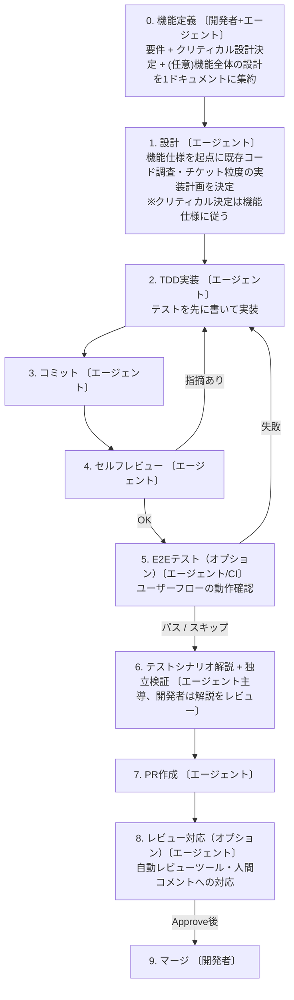

# AI駆動開発戦略

## 1. 概要

本ドキュメントは、AI駆動開発における**開発フローと品質保証**を定義する。

核となる考え方:

- **開発者は要件定義とレビュー・承認に集中し、設計・実装はAIエージェントが担う**
- **1エージェントが1チケットを設計〜実装〜PR作成まで自律的に完結させる**
- **手戻りの大きいクリティカルな設計（DB設計等）に限り、実装前に人がレビューする**
- **変更のリスク・重要度に応じてユーザーがレビュー範囲を判断し、人的レビュー負荷と品質のバランスを取る**

> 本ドキュメントは開発フローに必要な汎用的な枠組みを定義する。チーム体制・役割分担・オーナーシップといった組織固有の運用は、各プロジェクト側で定義する。

### 関連ドキュメント

- [ブランチ戦略](./branching-strategy.md) — GitHub Flow、PR規約

---

## 2. エージェントの1チケット実行フロー

AI駆動開発では、**1エージェントが1チケットを最初から最後まで完結させる**構成をとる。開発者は要件を定義してエージェントに渡し、設計・実装はエージェントに委ねて、生成物のレビュー・承認に集中する。

```
開発者
├── エージェント 1 ──→ チケット A（実装→テスト→セルフレビュー→PR作成）
├── エージェント 2 ──→ チケット B（実装→テスト→セルフレビュー→PR作成）
├── エージェント 3 ──→ チケット C（実装→テスト→セルフレビュー→PR作成）
└── エージェント 4 ──→ チケット D（実装→テスト→セルフレビュー→PR作成）
```

Claude Code を使用する場合の階層:

| 階層 | 役割 | 例 |
|------|------|-----|
| メインセッション | 1チケットの開発サイクル全体を管理 | `/para-impl 123` で自律実行 |
| サブエージェント | メインセッション内で特定タスクを実行 | コードベース探索、テスト実行 |
| Skills | 定型タスクの自動実行 | `/commit`, `/self-review`, `/quality-check` |

要件は開発者が定義し、**設計以降はエージェントが自律的に実行する**。**クリティカルな設計の意思決定（DB スキーマ・認証/認可・外部連携 等）は機能定義の段階でまとめて行い**、機能仕様ドキュメント（`docs/features/{slug}.md`）に記録する。実装フェーズに人間ゲートを残さないことで、複数チケットの並列実装を中断なく走らせる。


```mermaid
flowchart TD
    A["0. 機能定義 〔開発者+エージェント〕<br/>要件 + クリティカル設計決定 + (任意)機能全体の設計を1ドキュメントに集約"]
    B["1. 設計 〔エージェント〕<br/>機能仕様を起点に既存コード調査・チケット粒度の実装計画を決定<br/>※クリティカル決定は機能仕様に従う"]
    E["2. TDD実装 〔エージェント〕<br/>テストを先に書いて実装"]
    F["3. コミット 〔エージェント〕"]
    G["4. セルフレビュー 〔エージェント〕"]
    K["5. E2Eテスト（オプション）〔エージェント/CI〕<br/>ユーザーフローの動作確認"]
    EX["6. テストシナリオ解説 + 独立検証 〔エージェント主導、開発者は解説をレビュー〕"]
    H["7. PR作成 〔エージェント〕"]
    I["8. レビュー対応（オプション）〔エージェント〕<br/>自動レビューツール・人間コメントへの対応"]
    J["9. マージ 〔開発者〕"]

    A --> B
    B --> E
    E --> F
    F --> G
    G -->|指摘あり| E
    G -->|OK| K
    K -->|失敗| E
    K -->|パス / スキップ| EX
    EX --> H
    H --> I
    I -->|Approve後| J
```

> **ブランチ運用の前提**: このフローは「**1チケット = 1ブランチ → PR → 必須ゲート通過後に mainline へマージ**」を前提とする（タスクを分離し、PR経由で統合する）。この最小契約さえ満たせば、ブランチ命名・マージ方式・リリース方式などの具体は各プロジェクトで自由に定めてよい。既定例は [ブランチ戦略](./branching-strategy.md) を参照。

---

## 3. 品質保証とレビュー負荷の設計

### 3.1 基本方針

AI駆動開発では「AIが実装し、人間がレビュー・承認する」形をとる。ここで課題となるのが**人的レビュー負荷**である。

現在のAIエージェントは設計・コードとも品質が十分に高く、詳細設計や実装そのものに問題があるケースは少ない。そこで本戦略では、**人間のレビューを次の2点に絞る**:

- **機能定義（要件 + クリティカル設計決定）**: 「何を作るか」と「DB設計・スキーマ変更、認証/認可、外部連携など、誤ると手戻りが大きい設計の方針」を人間が決める。これらを**機能定義の段階でまとめて決定**することで、実装フェーズに人間ゲートを残さず、複数チケットの並列実装を中断なく回せる（→ 3.4）。
- **テストシナリオ解説（実装後）**: 実装が一通り終わった段階で、AIが各E2Eを自然言語で解説する。人間はその解説を完了条件と突き合わせて確認する（→ 3.3）。

**詳細設計・実装・コードはエージェントを信頼**し、品質は**テスト（特にE2Eテスト）とセルフレビューを主軸**に担保する。どこまで人的レビューを広げるかは固定の段階で定めず、**変更のリスク・重要度に応じてユーザーがケースバイケースで判断する**。

なお、**自動・セルフで常に通す必須ゲート**は、レビュー範囲の判断に関わらず適用する:

| 必須ゲート | 内容 | 担い手 |
|----------|------|--------|
| Lint・型チェック・テスト | PR作成前にパスする | エージェント（`/quality-check` 等で自動） |
| セルフレビュー | テスト設計・実装とコードを自己検証、完了条件の達成を確認 | エージェント |
| CI | 全テストがパスする | 自動 |
| マージ | 必要なゲートを通過後にマージ | 開発者 |

### 3.2 レビューの優先順位

人的レビューは**優先度の高い観点から行い、変更のリスク・重要度に応じて、どこまで下位の観点をレビューするかをユーザーが判断する**。観点の優先順位は次のとおり。

| 優先度 | レビュー観点 | 内容 |
|------|------------|------|
| 1（Must） | 動作確認・E2E | ユーザーフローが期待どおり動くか。最低限の動作確認は必須、必要に応じて自動E2Eに拡大 |
| 2 | 要件（AIへの入力）・クリティカルな設計 | 「何を作るか」と、DB/スキーマ・認証/認可・外部連携 等の手戻りの大きい設計（→ 3.4） |
| 3 | それ以外の設計（詳細設計） | クリティカル以外の設計判断 |
| 4 | コード | 実装コード・テストの精読 |

- **優先度1〜2は常に必須**。動作確認・E2Eで品質を担保し、要件とクリティカルな設計の正しさを人間が確認する。
- **リスク・重要度が高い変更では優先度3→4へ対象を広げる**。詳細設計のレビューを加え、特に重要なものはコードレビューも足す。
- 詳細設計・コード（優先度3〜4）は本来エージェントを信頼する領域であり、人的レビューを足すかはユーザーが変更ごとに判断する。

> **原則**: AIは詳細設計・コードとも品質が十分高い。人間がまず時間をかけるべきは「動作するか（動作確認・E2E）」「何を作るか（要件）」「手戻りの大きいクリティカルな設計」であり、詳細設計やコードの精読は後回しでよい。

#### どこまで広げるかの判断基準

下位の観点（詳細設計→コード）までレビューを広げ、E2E自動化・手動QA・第三者レビューを足すかは、次の要因が高い変更ほど手厚くする。

| 判断要因 | レビュー・テストを手厚くする方向 |
|---------|------------------------------|
| ユーザー影響範囲 | 広いほど手厚く |
| データの機密性 | 高いほど手厚く（該当時はクリティカル箇所として必ずレビュー → 3.4） |
| 規制・コンプライアンス | 厳格なほど手厚く（第三者レビュー・テストエビデンス） |
| 障害時の影響 | 大きいほど手厚く |
| 仕様の安定度・コード寿命 | 安定・長寿命なほどテスト整備・レビューの投資価値が高い（短命なら軽く） |

### 3.3 テスト戦略

コードレビューを最小限に抑える代わりに、**テストを品質担保の主軸**とする。各テストの責務は以下のとおり。

| テスト種別 | 実行者 | 目的 |
|-----------|--------|------|
| 単体テスト / 結合テスト | AIエージェント | 実装の正しさを検証 |
| テスト設計・実装のセルフレビュー | AIエージェント | テスト観点の網羅性・テスト実装の妥当性を自己検証 |
| E2Eテスト（自動） | CI / AIエージェント | ユーザーフローの動作保証 |
| 動作確認（ライブ） | AIエージェント（人間は観察） / 開発者 | 画面を操作して期待どおり動くかを確認 |
| E2Eテスト（手動） | 開発者（必要に応じて手動QA） | 自動化困難な操作・UXの確認 |

> **動作確認のAI化**: 優先度1の「動作確認」は、AIが可視ブラウザ（Headed Playwright）でアプリを操作・実況し、**人間は画面を観察して承認するだけ**の形を取れる。成功したシナリオはそのままE2Eテストとして永続化できる（動作確認とE2E整備の一気通貫）。

E2Eテストの範囲は、変更のリスク・重要度に応じてユーザーが判断して広げる（→ 3.2 の判断基準）。

#### E2Eレビューの工夫

E2Eはコードレビューを最小化する本戦略の品質の主軸であり、重要度が上がるほど価値も工数も大きくなる。一方でE2E実装コードを人間が精読するのは負荷が高い。そこで**E2Eは実装コードではなく、AIによる解説と設計（観点）をレビューする**。人間は常にコードを読まず、次の3層で確認する。

| 層 | タイミング | レビュー対象 | 担い手 | 目的 |
|----|-----------|------------|--------|------|
| 設計セルフレビュー | 実装前 | E2Eシナリオ（観点）一覧／完了条件とのトレーサビリティ | **AIエージェント** | 正しいフローを過不足なくカバーしているか |
| テストシナリオ解説 | 実装後 | AIによる各E2Eの解説（対象フロー・前提・操作手順・検証内容・カバー/非カバー範囲） | **人間**（AI が解説を生成） | 正しい観点で検証しているか |
| 独立検証 | 実装後 | 解説とコードの整合・テストの有効性 | AI主導／人間は結果を確認 | 解説どおりにテストが機能しているか |

- **設計セルフレビュー**: 実装前に、AIが要件・完了条件からE2Eシナリオ一覧を提案し、**AI自身が完了条件とのトレーサビリティ表で過不足をセルフチェックする**。人間ゲートは入れない（並列実装の中断を避ける）。
- **テストシナリオ解説**: 実装後に、AIが各E2Eを自然言語で解説する。**人間はここで初めて参加**し、解説を要件（完了条件・受入基準）と突き合わせて確認する。解説内容を信頼してコードは読まない。
- **独立検証**: テストシナリオ解説の確認だけでは「解説とコードの乖離」（アサーションが無い・実行されない等）を見抜けない。次のいずれかで担保する。
  - AIが実装コードを読み、解説の忠実性とアサーションの妥当性をチェックする（人間はコードを読まない）
  - **実行エビデンス**（Playwright の trace／動画／スクリーンショット）でフローが実際に通っていることを確認する
  - 重要フローは**ミューテーション（故意の不具合注入）**でテストが確かに失敗することを確認する

> **原則**: コードレビューで見つけるべきバグは、テストで検出する。設計レビューで方向性を正し、テストで品質を担保する——これがAI駆動開発における品質保証の基本構造である。

### 3.4 クリティカル箇所

以下に該当する場合、**レビュー範囲の判断に関わらず**、最低限のレビューを必須とする（使い捨て前提の検証コードを除く）:

- セキュリティに関わる箇所（認証・認可、入力検証）
- 機密データ・個人情報の取り扱い
- 外部システム連携
- データベーススキーマの変更

#### 意思決定のタイミング

クリティカル設計の意思決定は**機能定義の段階でまとめて行う**（`/define-feature` の責務）。実装フェーズに人間ゲートを置かないことで、複数チケットの並列実装を中断なく回せる。

機能仕様ドキュメント（`docs/features/{slug}.md`）には「クリティカル設計決定」セクションを設け、認可モデル・暗号化方式・スキーマ方針・外部API契約などの方針を記録する。後続の `feature-implementer` は、その決定に従って実装する（独自判断で逸脱しない）。

#### レビューの担い手

| レビュー | 担い手 | タイミング | 要否 |
|---------|--------|------------|------|
| クリティカル設計の意思決定 | 人間 | **機能定義時** | **必須**。脅威モデル・影響範囲・不可逆性など、人間の判断が要る領域 |
| コードレビュー | AIエージェント（専用レビューエージェント） | 実装中 | **必須** |
| コードレビュー | 人間 | PRレビュー時 | 必須としない。重要度が極めて高い場合や、AIが懸念を上げた場合にエスカレーション |

> **理由**: クリティカル箇所でも、コードの精査はAIの方が安定して網羅的なことが多い。希少な人的リソースは**機能定義時の設計判断**に集中させ、コードはAIレビュー＋テストで多層に担保する。

> **注意**: 使い捨て前提のコードであっても、クリティカル箇所を含む変更を本番コードに流用する場合は、必ず再レビューを行うこと。

### 3.5 承認ゲート（本番影響ベース）

人間ゲートは「操作の見た目」ではなく **本番への影響と可逆性** で置く。可逆で本番影響のない操作は自律実行し、不可逆・本番影響のある操作にだけ人間承認を要求することで、レビュー地獄・逐次承認を避けつつ安全性を担保する。

| 操作 | 本番影響 | 可逆性 | 承認 |
|------|---------|--------|------|
| topic / 統合ブランチへの push・PR・マージ | なし | 可逆（`main` 未反映） | **不要**（自律実行可） |
| `main` へのマージ | あり（デプロイ即稼働） | 実質不可逆 | **必須**（人間） |
| 本番公開・リリース・タグ付与 | あり | 実質不可逆 | **必須**（人間） |
| ブランチ/データ削除・履歴破壊（force-push 等） | 状況次第 | 不可逆 | **必須**（人間） |

> **原則**: `main` マージ・本番公開・削除・履歴破壊のみ人間承認。**統合ブランチや topic ブランチへの push・PR・マージは自律実行可**。これは「クリティカル設計の意思決定は機能定義時にまとめて行い、実装フェーズに人間ゲートを残さない」（→ 3.4）という方針を、**大きめ機能の実装フロー**に拡張したものである。

#### 統合ブランチ方式

大きめの機能を自走で実装しつつ `main` を常に本番安全（デプロイ即稼働可）に保つため、**親 Issue 単位の統合ブランチ（integration branch）** を用いる:

- 親 Issue に対し `main` から統合ブランチ `feat/issue-<親>` を切る。
- 実装サブタスクは **統合ブランチを base に PR → レビュー対応 → 統合ブランチへ自律マージ**（`main` を触らないので本番影響なし＝人間ゲート不要）。
- 全サブタスク完了後、統合ブランチで **人間が最終動作確認 1 回** → **統合 → `main` 昇格（人間承認）**。
- ⇒ 人間の関与は「最後の動作確認＋`main` マージ承認」という**不可逆点**だけに集約できる。

具体的な base 指定・自律マージ・昇格の運用手順は [ブランチ戦略](./branching-strategy.md) の「統合ブランチ運用」を参照。`/create-ticket`・`/para-impl` の `--base` 指定、`/pr-merge` の base 別ゲート判定がこれを支援する。

---

## 4. ナレッジ管理

### 4.1 AIエージェントへのコンテキスト共有

AIエージェントが正確に実装するには、十分なコンテキストの提供が不可欠である。ただし**必要なドキュメントはプロジェクトによって変わる**ため、絶対に必須のものだけを定め、それ以外は**プロジェクトごとに「何を作るか」を決める**運用とする。

#### 必須ドキュメント

| ドキュメント | 目的 | 更新頻度 |
|------------|------|---------|
| CLAUDE.md | プロジェクトコンテキスト（規約・構成・コマンド）の起点。全エージェントが参照する | 随時 |

> CLAUDE.md は `/init-project` で生成・整備できる。

#### プロジェクトごとに選定するドキュメント

CLAUDE.md 以外は、プロジェクトの特性（規模・ドメイン・技術スタック・チーム）に応じて必要なものだけを整備する。候補例:

- コーディングガイドライン（コード規約の統一）
- アーキテクチャ設計書（全体構成の理解）
- API仕様書（エンドポイント定義）
- テーブル定義書（DB構造の理解）
- 用語集（ドメイン知識の共有）
- その他、プロジェクト固有のドキュメント

どのドキュメントを整備するかは、立ち上げ時に**ドキュメント選定スキル**で判断する（プロジェクトの特性から、必要なドキュメントセットと作成優先度を提案）。整備したドキュメントは CLAUDE.md から参照を張り、エージェントが辿れるようにする。

### 4.2 チケットの質がエージェントの質を決める

AIエージェントのアウトプット品質は、**チケットの記述品質**に直結する。

良いチケットの条件:
- 1エージェントが独立して完結できる粒度
- 明確な完了条件（受入基準）
- 参照すべきドキュメント・コードの明示
- 技術的な制約の記載
- 他チケットとの依存関係の明示

チケット作成は `/create-ticket` スキルが支援する（チケット構造・粒度のガイドを含む）。

### 4.3 恒常的な設計決定の記録（ADR）

機能仕様（`docs/features/`）と Issue は**その機能が終われば役目を終える**文書であり、保証台帳（→ 5.3）は**すでに守っている振る舞い**を記録する。どちらにも収まらないのが、**機能をまたいで今後の実装が従い続ける決定**（認可モデル・スキーマ方針・依存の方向 等）である。これを置く場所が **ADR（Architecture Decision Record）** であり、本節がその規約の正本である。

**ADR はオンデマンドである。** `/define-feature` → `/create-ticket` → `/para-impl` の定常フローに必須ステップとして組み込まない（毎機能で ADR を書かせると、読まれない記録が増えて受け皿として機能しなくなる）。**唯一の例外は 5.5 手順4 の機能仕様の退役**で、仕様の削除が不可逆であるため昇格の要否判定を必須ステップとする。

作成・改訂は `/create-adr` が支援する（記録モードと、退役する機能仕様からの昇格判定モードの2モード）。

#### 何を ADR にするか（乱造防止の線引き）

**ADR に書くのは「宣言元の Issue を読まなくても理解できる必要がある恒常的決定」だけ**とする。個別機能の検討経緯は Issue（GDD期では各保証の `宣言元` Issue）に委ね、ADR へ持ち込まない。

次の**3条件をすべて満たすものだけ**を ADR にする（1つでも欠けたら書かない）:

1. **恒常性**: 特定の機能・チケットが終わったあとも効き続け、今後の実装が従い続ける。
2. **非自明性**: 結果のコード・テスト・保証台帳を読んだだけでは「なぜそうなっているか」を復元できない。
3. **選択性**: 妥当な代替案が実在し、却下した理由を残さないと再燃・蒸し返しが繰り返される。

判定に使う1問: **「この決定を知らない人・エージェントが、Issue を掘らずにコードだけを見て作業したとき、決定に反する実装をしうるか」**。Yes なら ADR、No なら書かない。

| ADR に**書く** | ADR に**書かない**（委ね先） |
|---|---|
| 認証・認可モデルの選択とその適用範囲 | 個別機能の要件・受入基準（機能仕様 → Issue） |
| DB スキーマの方針（正規化方針・テナント分離方式・マイグレーション規律） | すでに守っている公開面の振る舞い（保証台帳 → 5.3） |
| エラー応答形式・API バージョニングなど契約の**原則**（個別エンドポイントの仕様ではない） | 実装の内部設計・アルゴリズム選択（コードとテストが正） |
| モジュール依存の方向・レイヤ境界の規律 | 一度きりの移行・作業の実施記録（PR と git 履歴が正） |
| 採用／不採用を決めた基盤技術・外部サービスとその理由 | 個別機能の検討経緯・トレードオフの議論（宣言元 Issue） |
| 組織・法令・契約に由来する制約と、その適用方針 | 恒常的だが自明な事実（コードを読めば分かる構成） |

- **迷ったら書かない**。ADR にしなかった判断自体は Issue・PR 本文に残せば追跡できる。
- **既存 ADR の改訂で足りるなら新規作成しない**。同じ問いへの答えの更新を別ファイルに分けると、どれが現行かが分からなくなる。

#### 置き場・命名・採番

- **置き場**: `docs/adr/`（`CLAUDE.md` のドキュメントマップで別パスを指定している場合はそれ）。
- **ファイル名**: `NNNN-slug.md`。`NNNN` は4桁ゼロ埋めの連番、`slug` は決定内容のケバブケース（例: `0002-auth-model.md`）。
- **採番**: 置き場の `NNNN-` 形式のファイル名の**最大値 + 1**。欠番は埋めず、**番号は再利用しない**（過去の参照「ADR 0007」の指す先を変えないため）。並列ブランチで同番号を採ってしまった場合は、**後からマージする側が採り直す**。
- **ADR 以外の記録**（実機検証記録・アーカイブ等）を同じディレクトリに置く場合は、**`NNNN-` で始まらない名前**にする（例: `archive-2026-08-01-<slug>.md`）。日付始まりの `2026-08-01-...` は 4 桁数字＋ハイフンの形が連番と区別できないため使わない。

#### 構成とステータス

本文は **背景 / 決定 / 検討した代替案 / 帰結** の4節を必須とし、冒頭にメタ情報（ステータス・日付・関連）を置く。見出しは決定の要約とし、**結論を先に読める**こと。該当しない項目は空欄で残さず削除する。

| ステータス | 意味 |
|---|---|
| `Accepted` | 現行の決定（初版の既定値）。ADR を含む PR のマージが裁可にあたる |
| `Amended` | 同じ問いへの答えを改訂した（本文末尾に「改訂」節がある） |
| `Superseded by ADR NNNN` | 別 ADR に置き換えられた（本文は歴史的記録として残す） |
| `Rejected` | 検討したが採用しなかった（同じ提案の再燃を防ぐために残す） |

#### 改訂（既存の決定を覆すとき）

**確定済み ADR の本文（背景・決定・代替案・帰結）は書き換えない。** 何を根拠に何を決めたかが失われると、ADR の価値そのものが失われる。

| 状況 | 扱い |
|---|---|
| **同じ問い**への答えが変わった | 元 ADR の末尾に `## 改訂（YYYY-MM-DD）` を追記し、ステータスを `Amended` にする |
| **問い自体が変わった**（前提・スコープが別物になった） | 新しい ADR を作り、元 ADR を `Superseded by ADR NNNN` にする（元の本文は残す） |
| 誤字・リンク切れ・表記ゆれ | そのまま修正してよい（決定内容に触れないため） |

---

## 5. 開発フェーズとドキュメントライフサイクル

プロジェクトのライフサイクルによって、エージェントを駆動する「正の文書」は変わる。立ち上げ期は**これから作るもの**を書いた機能仕様（SDD: Spec-Driven Development）が正であり、運用期に入ると**すでに守っているもの**を書いた保証台帳（GDD: Guarantee-Driven Development）の方が正になる。本章はその2フェーズの定義・宣言方法・保証台帳の書式・切り替え手順の**正本**である。

各 SKILL.md には規律の要点のみを書き、詳細は本章を参照する。

> **段階導入中**: フェーズ宣言の判定（`detect-dev-phase.sh`）・本章の書式規約・**台帳の監査（`/guarantee-audit` の bootstrap / drift）**は導入済み。**各スキルへのフロー統合**（Issue の保証節・裁可ラベル・`/quality-check` の索引整合ゲート・`/promote-verify` の保証整合チェック・`feature-implementer` の保証ブリーフ）は未導入で、順次入れる。現時点で GDD期を選んだ場合、**台帳の起こし方と点検は `/guarantee-audit` で自動化されているが、実装フロー中の台帳更新（新しい保証の追記・テスト改名時の索引修正）は人間とエージェントの手動運用**になる。導入計画の全体像は `docs/gdd-design-draft.md`。

### 5.1 2つのフェーズ

| フェーズ | 駆動文書 | 正とするもの | 主な時期 |
|---|---|---|---|
| **SDD期** | 機能仕様（`docs/features/{slug}.md`） | これから作る要件・クリティカル設計決定 | 立ち上げ〜初回リリース前後 |
| **GDD期** | 保証台帳（`docs/guarantees.md`） | すでに守っている公開面の約束（＋それを裏付けるテスト） | 運用期（既存挙動の変更・修正が主になった後） |

- **後方互換**: フェーズ宣言が無いプロジェクトは従来どおり SDD期として動く。既存プロジェクトは何もしなくても挙動が変わらない。
- **GDD期でも機能仕様は使い続ける**（`/define-feature`）。ただし位置づけを「リリースまでの**短命な作業文書**」に変え、リリース後は 5.5 の退役手順で台帳・ADR へ吸収して削除する。クリティカル設計をまとめて決めておく価値（＝実装フェーズに人間ゲートを残さない）はフェーズに依存しないため。

### 5.2 フェーズ宣言（CLAUDE.md）

フェーズは導入先プロジェクトの `CLAUDE.md` に**固定見出しで宣言する**。機械可読性のため書式を固定する:

```markdown
## 開発フェーズ

- **フェーズ**: GDD期
- 駆動文書: docs/guarantees.md
```

- 許容値は `SDD期` / `GDD期` の2値。`駆動文書` 行は人間向けの注記であり、判定には使わない（欠落しても宣言を無効化しない）。
- **見出し自体が無い場合のみ SDD期 とみなす**（後方互換）。
- **GDD期 を有効化できるのは、人間が有効な宣言を `CLAUDE.md` に記載した場合のみ**。開発フローのエージェントは宣言を読むのみで書き換えない。`docs/guarantees.md` 等の他ファイルの存在を自動判定の入力にしない（`/init-project` はそれを「推奨値の提示」にのみ使う）。
- **唯一の例外は `/init-project` による `CLAUDE.md` の生成・マージ**（宣言そのものを人間と一緒に起こす工程）。この例外にも次の条件を課す:
  - **`GDD期` を書き込むには人間の明示的な同意が必要**（既定候補として提示し、同意が得られた場合のみ記載する。同意が得られなければ `SDD期`）。
  - `SDD期`（＝宣言なしと同じ挙動で、新規プロジェクトの既定）は、検出結果の提示に含めてユーザーが訂正できる形で確定してよい（訂正が無ければ承認とみなす）。**ゲートが増える方向（GDD）だけを明示同意にする**という線引きであり、現状維持の方向に確認ゲートを増やさない。
  - **例外が及ぶのは「宣言が無いプロジェクトに初めて宣言を起こす場合」だけ**。既存 `CLAUDE.md` に有効な宣言（`declared_sdd` / `declared_gdd`）がある場合は、上書き生成・マージ・再実行のいずれでも**その値をそのまま維持**する。ユーザーが同意した／要望した場合でも、`/init-project` はフェーズ値を**書き換えない**。
  - 理由: **フェーズの切り替えは宣言1行の編集ではなく 5.5 の手順一式**（台帳のブートストラップ・裁可・機能仕様の退役・ドキュメントマップ更新）だからである。宣言だけを書き換える経路を作ると、台帳が無いまま GDD のゲートが有効になる（＝ 5.6 / `/promote-verify` が「運用前提の破れ」として止める）半端な状態を、初期設定スキルから作れてしまう。切り替え要望を受けた場合は、`/init-project` はフェーズ値を変えずに 5.5 の手順を案内する。
  - 判定が `invalid` の場合はフェーズ節を生成せず、人間に宣言の修正を促す。
- **不正な宣言は SDD期 へ黙ってフォールバックしない**。見出しの重複・許容値以外の値・未置換のプレースホルダ（`{DEV_PHASE}`）等は「不正」と判定し、フェーズ依存の処理を停止して要人間判定として報告する。黙って SDD期 に倒すと、宣言の書き間違い1つで GDD のゲート群が暗黙に無効化されるため。

#### 判定は `detect-dev-phase.sh` に一元化する

判定は決定的スクリプト `scripts/detect-dev-phase.sh` に切り出してある。出力は `{phase: "sdd"|"gdd"|"invalid", reason, source}` の機械可読 JSON で、exit code は `0`=sdd/gdd 確定 / `1`=invalid / `2`=実行前提の欠落。入出力仕様の正本は `scripts/specs/detect-dev-phase.md`。

**フェーズ依存の挙動を持つスキルは、このスクリプトの出力のみを正とし、各スキルが `CLAUDE.md` を独自に grep しない**（判定規約が実装ごとに分岐するのを防ぐため）。

#### フェーズ判定の共通文言（各 SKILL.md へコピーする定型文）

フェーズ分岐は複数のスキルに入るため、読み取り手順の記述を統一する。以下を**そのままコピーし**、スキル固有の追加挙動（`gdd` のときに何をするか）はこの直後に続けて書く（`docs/plugin-path-conventions.md` (f) のとおり、規範は実行時ファイルにインラインで書き切り、出典は HTML コメントで残す）:

```text
> **開発フェーズの判定（重要）**: フェーズは必ず `claude-harness-run detect-dev-phase` の出力だけで判定し、`CLAUDE.md` を自分で grep しないこと（判定規約の重複実装を防ぐため）。stdout に `{"phase":"sdd"|"gdd"|"invalid","reason":"...","source":"..."}` が1個返る。フェーズ依存の追加挙動は **`phase` が `gdd` のときだけ**行い、`sdd`（宣言なしを含む）では一切挙動を変えない。**`phase` が `invalid`（exit 1）、またはスクリプトを実行できない・stdout が JSON としてパースできない（exit 2 等）場合は、`sdd` とみなさない**。フェーズ依存の処理を停止し、`reason` と `source`（および stderr のメッセージ）を添えて「要人間判定」としてユーザーに報告すること（不正な宣言や実行失敗によって GDD のゲート群が暗黙に無効化される事故を防ぐため）。`claude-harness-run: command not found` の場合のみ `bash "<プラグインルート>/scripts/detect-dev-phase.sh"` にフォールバックする（パスは引用符で囲む。プラグインルートはスキル起動時の「Base directory for this skill」から解決した絶対パス。`${CLAUDE_PLUGIN_ROOT}` は表記上のプレースホルダであり環境変数ではない）。
<!-- 正本: docs/ai-driven-development-strategy.md 5.2 / docs/plugin-path-conventions.md -->
```

`reason` は `sdd` の中でも「明示的に SDD期 と宣言されている（`declared_sdd`）」と「宣言が無い（`no_phase_section` / `no_claude_md`）」を区別する。宣言の有無自体を扱うスキル（`/init-project` の CLAUDE.md 生成・マージ等）はこの区別を使ってよい。

適用先（順次導入。**この定型文以外の判定手段を新たに実装しない**）: `/init-project`（適用済み）・`/define-feature`・`/create-ticket`・`/para-impl`（`feature-implementer` を含む）・`/quality-check`・`/promote-verify`。

### 5.3 保証台帳（`docs/guarantees.md`）の書式

保証台帳は「自然言語の約束宣言」「テスト対応索引」「Gaps（テストのない公開面）」の3要素を1ファイルに統合する。**約束1件 = 見出し1つ + 安定 ID** とし、テスト対応索引は別表にせず各約束の直下に置く（別セクションに分けると約束と索引の間で二重管理のドリフトが生じるため）。

```markdown
# 保証台帳

<!-- 保証 ID は G-{宣言元番号}-{枝番}。退役しても ID は再利用しない。 -->

## 保証（Guarantees）

### G-123-1: POST /api/contact は JSON パース不能時に 400 と {"error":"invalid_json"} を返す

- 種別: API契約
- テスト: `tests/api/contact.test.ts::returns 400 for invalid json`
- 宣言元: #123

### G-130-1: 未認証ユーザーが /admin にアクセスするとログイン画面へリダイレクトされる

- 種別: 認可
- テスト: `e2e/auth.spec.ts::redirects unauthenticated user to login`
- 宣言元: #130

## Gaps（テストのない公開面）

- [ ] GAP-001: GET /api/health のレスポンス形式（テスト未整備）
```

書式の規約:

- **保証 ID**: `G-{宣言元番号}-{枝番}`。宣言元番号は約束を裁可した Issue 番号（台帳ブートストラップ由来のものは台帳を裁可した PR 番号）、枝番は同一宣言元内の連番。ID が宣言元に紐づくため中央の連番管理が不要で、並列に走る親 Issue 間で採番が衝突せず、Issue の裁可時点で正式 ID が確定する（仮 ID → 正式化という2段階を持たない）。**退役しても ID は再利用しない**。
- **GAP ID**: `GAP-NNN` の連番。再利用禁止。
- **テスト参照**: `` `<ファイルパス>::<テスト名>` `` の固定書式。複数可（1行1参照）。この書式が索引整合チェック（機械）のパース対象になる。
- **宣言元**: 約束を裁可した Issue 番号（ブートストラップ由来は裁可 PR 番号）。トレーサビリティの根拠。裁可前のドラフトでは `裁可待ち` と記載する。
- **退役**: 退役した保証は**行ごと削除**する（台帳内に「退役済み」節を残さない。履歴は git と宣言元 Issue で追う）。台帳自体がコンテキスト汚染源になるのを防ぐため。
- **Gaps の昇格**: テストが追加されたら本体の保証へ昇格し（そのテスト追加を裁可した Issue が宣言元になる）、GAP 行は削除する。
- **台帳に載せるのは公開面の約束のみ**（次項の線引き）。

#### 採番の単一経路（並列作業での ID 衝突防止）

ID の一意性は「書式」ではなく「**採番できる場所を1つに絞ること**」で担保する。並列に走るブランチが同時に採番しうる状態を作らない:

| ID | 採番する場所（ここでしか採番しない） | 並列でも衝突しない理由 |
|---|---|---|
| `G-{宣言元}-{枝番}` | **宣言元 Issue の「保証」節**（裁可＝`guarantee:approved` を付ける時点で枝番まで確定） | 実装ブランチは採番せず、裁可済み ID を台帳・テストへ**転記するだけ**。宣言元が違えば ID 空間も別 |
| `GAP-NNN` | **台帳（`docs/guarantees.md`）を更新する PR**（人間の裁可経路） | 監査（`/guarantee-audit`）は候補を報告するだけで台帳に書かない。追記経路が単一で直列 |

- **同一 Issue に後から保証を追加する**場合も、実装ブランチ側では採番しない。Issue の保証節を更新して再裁可し、その Issue 内の**既存の最大枝番 + 1** を採る（枝番の欠番は許容する。ID の再利用は禁止）。
- **裁可を経ない保証の追加を認めない**。実装中に「これも約束すべき」と気付いた場合は、既存のクリティカル設計逸脱と同じ経路で止め、Issue へ差し戻す（勝手に採番して台帳へ足さない）。
- **マージ時の重複チェック**: 台帳を変更する PR では、`G-` / `GAP-` の ID 重複が無いことを機械的に検査する。索引整合チェック（5.6・P2 で実装）に **ID 重複検出を含める**ことを実装要件とし、`/quality-check` の索引ゲートで落とす。人間の目視だけに頼らない。
- 上記の運用でも衝突が起きた場合（例: 裁可の分岐運用ミス）は、**新しい ID を採番して片方を付け替える**（既存 ID の意味を変えない。テスト索引の参照は ID をキーにしているため）。

#### 公開面と内部実装の線引き

判定基準は**「その振る舞いが変わったとき、リポジトリの外の誰か（エンドユーザー・他システム・他リポジトリ・運用者）が気付き得るか」の1問**。Yes → 公開面（台帳に載せる）、No → 内部実装（載せない）。

| 台帳に**載せる**（公開面） | 台帳に**載せない**（内部実装） |
|---|---|
| HTTP/API のリクエスト・レスポンス契約（ステータス・スキーマ・エラー形式） | 内部関数・private メソッドの単体テスト |
| CLI の引数・出力・終了コード | モジュール内部のデータ構造・中間表現 |
| UI から観測できる振る舞い（E2E テストが検証するもの全般） | リファクタリングで消えうるヘルパーの挙動 |
| ライブラリとして公開する API シグネチャと挙動 | フレームワーク接続の配線テスト |
| 永続化データのうち他システムが読む形式・イベント/webhook のペイロード | 自リポジトリしか読まない内部テーブルの詳細 |

- 内部実装のテストを載せると、リファクタリングのたびに台帳が動き、「約束の変更」と「実装の変更」が台帳上で区別できなくなる。**台帳の diff が「約束が変わったときだけ動く」状態を保つことが GDD の価値の中核**。
- E2E テストは定義上ほぼ全件が公開面。単体テストは**既定で内部実装**とし、公開契約を固定している場合（例: エラーレスポンス形式のスナップショット）のみ載せる。
- 判定に迷うケース（例: 他リポジトリが読んでいるか不明なデータ形式）は、どちらかへ倒さず**要人間判定**として保留のまま報告する。

### 5.4 SDD期 → GDD期 の切り替え判断

**切り替えの実行は人間の宣言（`CLAUDE.md` の編集）とする。** リリース回数・完了 Issue 数などの閾値による自動切り替えは採らない。切り替えはプロジェクト全体のドキュメント運用を変える実質不可逆な決定であり、「不可逆な決定は人間ゲート」（→ 3.5）の原則に合わせる。

推奨タイミングの目安（判断材料であり、条件ではない）:

1. **初回の本番リリース後**（既定ブランチが本番反映先として運用開始した時点）で検討を開始する
2. 「新規機能の追加」より「**既存挙動の変更・修正**」の Issue が過半になったら切り替えを推奨
3. `docs/features/` の記述と実装の乖離を修正するコスト（レビュー時の混乱・エージェントの誤読）を体感し始めたら即時切り替え

### 5.5 導入・切り替えの手順

既存プロジェクトへの後付け導入も、SDD期からの切り替えも手順は同じ:

1. **フェーズ宣言**: `CLAUDE.md` に `## 開発フェーズ`（GDD期）を追記する（人間が PR で実施）。
2. **台帳ブートストラップ**: `/guarantee-audit bootstrap` を実行し、既存テストから保証台帳のドラフトを作る。ドラフトは正本パス（`docs/guarantees.md`）ではなく `docs/guarantees.draft.md` に置き、未裁可の再実行が正本を上書きしないようにする（ドラフトが既に存在する場合は上書きせず停止する）。**ドラフトの段階では ID を振らない**（見出しは約束文のみ、`宣言元` は `裁可待ち`）。採番は手順3の裁可 PR が唯一の経路であり、仮 ID を置いて後から正式化する2段階は取らない。機械列挙できなかった公開面カテゴリは「未解析・要人間判定」として報告されるため、**Gaps が網羅的でない前提でレビューする**。
3. **台帳の裁可**: 人間がドラフトをレビューし（公開面判定の妥当性・Gaps の網羅）、裁可 PR で ID・宣言元を確定して `docs/guarantees.md` へ正本化する。この PR のマージが「台帳が正となった」時点。
4. **機能仕様の退役**: `docs/features/` の各ドキュメントを次のいずれかに片付ける。**削除の前に、対象の全件について「ADR 昇格の要否判定」を行う**（`/create-adr promote <機能仕様パス|ディレクトリ>`）。仕様の削除は不可逆であり、**ここが恒常的な設計決定を拾う最後の機会**であるため、**判定結果が「昇格不要」でも構わないが、判定そのものは省略しない**。
   - (a) まだ真である約束 → 保証台帳へ（手順2で大半はテスト経由で拾われている想定）
   - (b) 恒常的に参照すべきクリティカル設計決定（認可モデル・スキーマ方針等）→ ADR（`docs/adr/`。規約は 4.3）または恒常設計ドキュメントへ昇格。**何を昇格させるかは 4.3 の3条件で判定する**（機能仕様に書いてある設計記述を無条件に ADR 化しない）
   - (c) 残り → **ファイルごと削除**する。`docs/features/archive/` のようなアーカイブディレクトリは作らない（エージェントの Glob/Grep に露出し続け、コンテキスト汚染の予防という目的に反するため。履歴は git が保持し、`宣言元: #番号` から Issue 経由でも追える）
   - **退役 PR のレビュー観点は「削除して良いか」ではなく「昇格させるべき決定が残っていないか」**である。PR 本文には、対象の全件について (a)(b)(c) のどれに片付けたかと、昇格しなかったものについては**その判定理由**を載せる（「判定していない」と「判定した結果、不要だった」を読み手が区別できるようにするため。`/create-adr promote` の判定表をそのまま貼ればよい）
5. **CLAUDE.md ドキュメントマップの更新**: `docs/features/` の行を削除し、`docs/guarantees.md` を追加する。

手順2〜5 は1つの導入 PR にまとめてよい（いずれも `main` 昇格前は可逆）。

### 5.6 台帳のドリフト対策

台帳と実態の乖離（ドリフト）は2種類に分け、**決定的に検出できるものは機械で毎ループ、意味の判断が要るものは LLM で低頻度**という既存のレイヤリング（→ 3.1 の必須ゲート）に載せる。

| 種別 | 内容 | 検知手段 | タイミング |
|---|---|---|---|
| **索引ドリフト** | 台帳のテスト参照が実在しない（テストの改名・削除・移動）／ID の重複 | 決定的スクリプト `guarantee-index-check.sh`（入出力仕様の正本は `scripts/specs/guarantee-index-check.md`） | `/quality-check` の追加ゲートとして毎実装ループ（**ゲートへの組み込みは未導入**。現時点では `/guarantee-audit drift` 経由と手動実行で使う） |
| **意味ドリフト** | 参照は生きているが、約束の文言とテストの実際の検証内容が乖離／台帳に無い公開面テストの出現 | `/guarantee-audit drift`（LLM fan-out） | 定期実行 ＋ `main` 昇格前（`/promote-verify` のスコープ付きチェック。**昇格前チェックへの組み込みは未導入**） |

- 定期実行の**スケジューリングは導入先の運用に委ねる**（本プラグインは cron 相当の実行基盤を持たない）。CI の scheduled workflow・エージェントの定期サイクル・人間の手動実行のいずれでもよい。
- 監査は**報告までで、修正はしない**（監査と修正の分離。修正は通常の Issue → 実装フローに載せる）。

---

## 6. リスクと対策

| リスク | 対策 |
|--------|------|
| AIの出力品質のばらつき | 品質ゲート（自動チェック + 人間レビュー）で担保 |
| AIへの過度な依存 | クリティカル箇所は判断に関わらず必ず人間がレビュー |
| レビュー負荷の集中 | レビュー観点の優先順位に沿い、変更のリスク・重要度に応じて範囲を判断 |
| コンテキスト不足による実装ミス | CLAUDE.md・設計書・チケット記述の整備で対処 |
| レビュー省略による品質低下 | 省略は使い捨て前提のコードに限定。本番流用時は再レビュー必須 |
